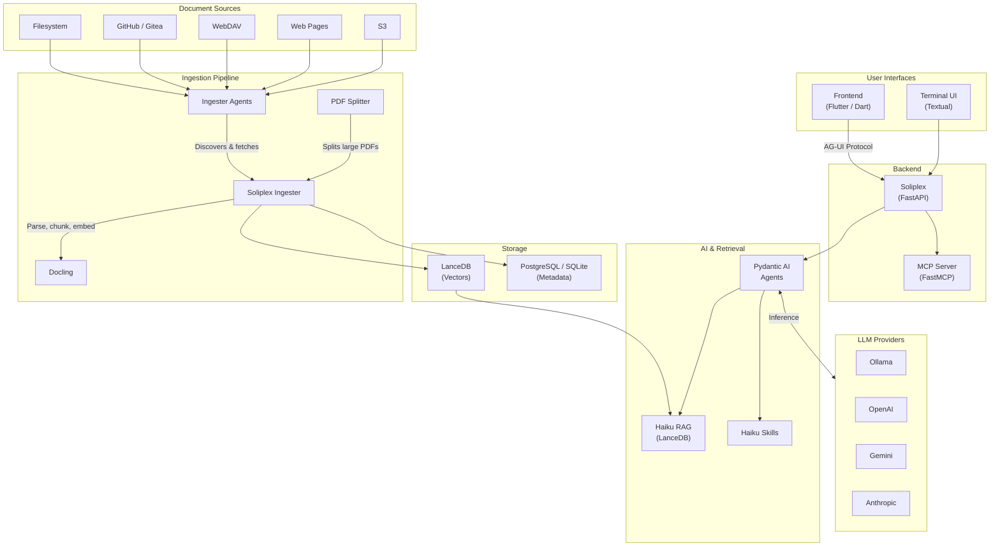

# Soliplex

Soliplex is a self-hosted, AI-powered Retrieval-Augmented Generation (RAG)
platform. It combines semantic document retrieval with generative AI to deliver
accurate, cited responses grounded in your document collections. The ecosystem
spans ingestion, indexing, retrieval, and user interface -- providing a
complete pipeline from raw documents to conversational AI.

> Full documentation: [soliplex.github.io](https://soliplex.github.io)

## Architecture

## Components

### [Soliplex](https://github.com/soliplex/soliplex) (Backend)

The core backend service built with FastAPI and Python. Soliplex orchestrates
AI agents, RAG retrieval, and real-time chat across isolated room
environments.

- Multi-room architecture with independent configurations and knowledge bases
- Multi-provider LLM support (OpenAI, Ollama, Gemini, Anthropic)
- OIDC/JWT authentication with Keycloak integration
- MCP server and client for extended AI tool integration
- AG-UI protocol for structured frontend communication
- Quiz system with LLM-based evaluation
- 100% unit test branch coverage

### [Frontend](https://github.com/soliplex/frontend)

A cross-platform Flutter application that serves as the primary user
interface. Runs on Android, iOS, macOS, Web, Linux, and Windows.

- Multi-server OIDC authentication with secure credential storage
- Room-based chat with streamed AI responses and execution step visibility
- RAG document filtering with source citations and PDF chunk visualization
- File uploads, interactive quizzes, and network diagnostics
- Responsive Material Design 3 layouts for mobile through desktop
- Modular shell architecture with composable feature modules

### [Ingester Agents](https://github.com/soliplex/ingester-agents)

A multi-source document discovery and delivery system. Ingester Agents
connect to diverse origins and feed documents into the ingestion pipeline.

- Filesystem, WebDAV, GitHub, Gitea, web page, and S3 source support
- Declarative YAML manifests with cron scheduling
- SHA-256 content hashing for incremental sync (only changed files processed)
- Async-first architecture with retry logic and exponential backoff
- FastAPI REST API and Typer CLI

### [Soliplex Ingester](https://github.com/soliplex/ingester)

The document processing engine that transforms raw files into indexed,
searchable vector data.

- Five-stage pipeline: validate, parse, chunk, embed, store
- Web UI and REST API for monitoring and managing ingestion runs
- Async worker-based processing tested at scale (1000+ page PDFs)
- Parameter set management for tuning chunking and embedding
- PostgreSQL metadata storage with LanceDB vector storage

### [PDF Splitter](https://github.com/soliplex/pdf-splitter)

A split-process-merge pipeline for converting large PDFs into structured
Docling documents through intelligent chunking and parallel processing.

- Bookmark-aware segmentation with multiple splitting strategies
- Parallel processing via ProcessPoolExecutor with strict memory isolation
- Document reassembly preserving DOM structure, provenance, and page offsets
- CLI tools for analysis, chunking, conversion, and validation

## Key Libraries

| Library | Role |
|---|---|
| [**Haiku RAG**](https://github.com/ggozad/haiku.rag) | RAG engine with hybrid vector + full-text search, agentic QA, and multi-provider embeddings |
| [**Haiku Skills**](https://github.com/ggozad/haiku.skills) | Modular skill system for Pydantic AI agents with sub-agent execution and AG-UI streaming |
| **Docling** | Document conversion and structural extraction for PDFs and other formats |
| **Pydantic AI** | Agent framework with function calling, tool integration, and multi-provider LLM support |
| **LanceDB** | Embedded vector database for semantic search and retrieval |
| **FastMCP** | Model Context Protocol server/client for AI tool interoperability |

## Documentation

Full configuration guides, tutorials, and API reference are available at
[soliplex.github.io](https://soliplex.github.io).
